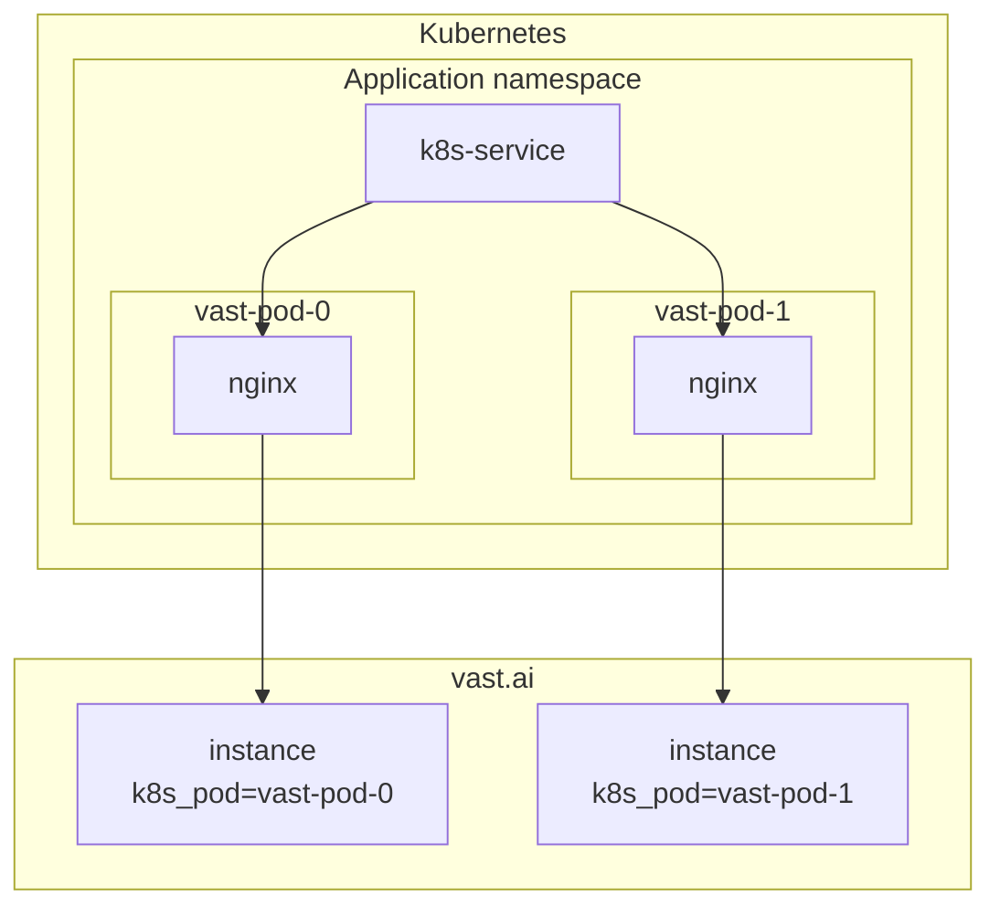

### Vast.ai k8s Pod Provisioner

The application provides a way to automate the creation of Vast.ai instances. It can be used in container orchestration environments such as Kubernetes (k8s). In combination with Kubernetes Services and healthchecks, it can automate the Continuous Deployment process for images.

The application creates instances from custom templates and recreates instances if the image needs to be changed or if the template has been modified. Workflow:
1. Get the instance template by the name provided in the `TEMPLATE_NAME` environment variable.
2. Check if an instance with the `k8s_pod=${POD_NAME}` label already exists in Vast.ai (`POD_NAME` will be provided through an environment variable) and:
   - Create the instance if it doesn't exist.
   - Delete the instance if the image is not the same as the one provided in `TEMPLATE_IMAGE`, or if the template hash ID is not the same as found in step #1.
   - Do nothing if instance is up-to-date
3. Wait for the instance to become online and for the external port to be provided. *
4. Generate an Nginx configuration with the `proxy_pass` configuration.
5. Run the Nginx process.

> A long-awaited instance host could be marked as blacklisted if the `BLACKLIST_ENABLED=true` environment variable is set.

This approach allows you to create a StatefulSet with static `POD_NAME`s and add a long startup probe plus a liveness probe to cover the case when the instance becomes unavailable. The pod becomes ready when the vast.ai instance is ready, and it can be used in k8s services.

You can configure the application via environment variables:

| ENV VAR                     | REQUIRED | DEFAULT                        | DESCRIPTION                                                              |
|-----------------------------|----------|--------------------------------|--------------------------------------------------------------------------|
| POD_NAME                    | TRUE     | -                              | Unique instance identifier                                               |
| VAST_API_KEY                | TRUE     | -                              | Vast.ai API key                                                          |
| VAST_TEMPLATE_NAME          | TRUE     | -                              | Private template name (will be created in your account)                  |
| VAST_TEMPLATE_IMAGE         | TRUE     | -                              | Target instance image                                                    |
| DOCKER_LOGIN                | TRUE     | -                              | Docker login command in the format `-u <user> -p <password> <host>`      |
| VAST_SEARCH_QUERY           | TRUE     | -                              | Vast [search new instance query](https://vast.ai/docs/search/search-gpus)|
| NGINX_CONFIG_PATH           | FALSE    | /etc/nginx/http.d/default.conf | Path to store the final Nginx config                                     |
| NGINX_LISTEN_PORT           | FALSE    | 3000                           | Nginx listen port                                                        |
| NGINX_MAX_BODY_SIZE         | FALSE    | 10M                            | Nginx `max_body_size` parameter                                          |
| BLACKLIST_ENABLED           | FALSE    | false                          | Enable blacklist logic                                                   |
| BLACKLIST_REDIS_URL         | FALSE    | redis://redis:6379/10          | Redis to be used as blacklist storage                                    |
| BLACKLIST_BAN_AFTER_SECONDS | FALSE    | 1200 (20 minutes)              | Waiting duration before instance marked as banned                        |
| BLACKLIST_BAN_TTL_SECONDS   | FALSE    | 604800 (7 days)                | Host ban duration                                                        |
| DEBUG                       | FALSE    | false                          | Enable debug logs                                                        |
